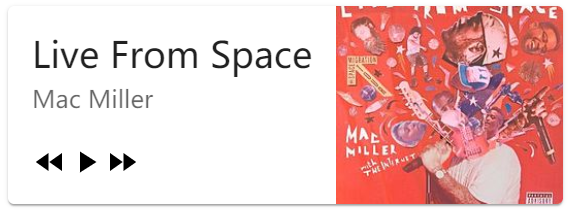
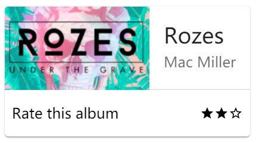
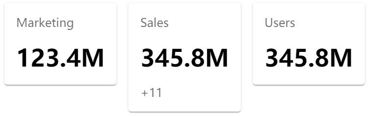

## Card 卡片

卡片是用来承载单个主题的内容和按钮。内容包括标题、文字、图标或者其它内容，如数据表格、表单空间等。

### Card

引入方式：`import Card from '@sinoui/core/Card';`

Card 组件是卡片的根组件，它有两种主要形式：

- 有阴影的，海拔默认为 1 的模式（默认模式，移动端的样式，pc 端也会用）
- 边框模式的，海拔为 0、有边框常用于 pc 设备端）

#### 属性

| 属性名    | 默认值   | 描述                                                              |
| --------- | -------- | ----------------------------------------------------------------- |
| outlined  | false    | 设置为`true`，表示是边框模式的卡片。                              |
| elevation | 1 或者 0 | 设置海拔（即阴影程度） 。默认为 1，但如果是边框模式，则默认为 0。 |
| className |          |                                                                   |
| style     |          |                                                                   |
| onClick   |          | 点击事件                                                          |
| as        | 'div'    | 指定根元素                                                        |

代码示例：

```tsx
export const BaseCard = () => (
  <Card outlined>
    <h4>Marketing</h4>
    <h1>123.4M</h1>
  </Card>
);
```

引入方式：`import CardPrimaryAction from '@sinoui/core/CardPrimaryAction ';`

CardPrimaryAction 组件是整个卡片的主操作区，支持各种交互形态（悬停、聚焦和按下）。

#### 属性

| 属性名  | 默认值 | 描述       |
| ------- | ------ | ---------- |
| onClick |        | 点击事件   |
| as      | 'div'  | 指定根元素 |

代码示例：

```tsx
export const CardPrimaryActionCard = () => (
    <Card outlined>
      <CardPrimaryAction>
       <h4>Marketing</h4>
       <h1>123.4M</h1>
      </CardPrimaryAction>
    </StyledCardWrapper>
);
```

说明：和 Card 组件展示的示例区别为该示例交互时有动态效果。

### CardActions

引入方式：`import CardPrimaryAction from '@sinoui/core/CardPrimaryAction ';`

CardActions 组件是整个卡片的辅助操作区域。

#### 属性

无

示例：

```tsx
const CardAction = () => {
  return (
    <Card>
      <CardPrimaryAction>...</CardPrimaryAction>
      <CardActions>...</CardActions>
    </Card>
  );
};
```

### CardActionButtons

引入方式：`import CardActionButtons from '@sinoui/core/CardActionButtons';`

CardActionButtons 组件是用来承载卡片按钮的容器。

#### 属性

无

代码示例：

```tsx
const CardActionButtons = () => {
    return <Card>
      <CardPrimaryAction>...</CardPrimaryAction>
      <CardActions>
        <CardActionButtons>
          <button>read</button>
          <button>bookmark</button>
        </CardActionButtons></CardActions>
    </Card>
}

// CardActions组件中只有CardActionButtons时可简化为
const CardActionOmlyButtons = () => {
    return <Card>
      <CardPrimaryAction>...</CardPrimaryAction>
      <CardActions>
        <button>read</button>
        <button>bookmark</button>
    </Card>
}
```

### CardActionIcons

引入方式：`import CardActionIcons from '@sinoui/core/CardActionIcons';`

CardActionIcons 组件是用来承载卡片图标的容器。

#### 属性

无

代码示例：

```tsx
const CardActionIcons = () => {
    return <Card>
      <CardPrimaryAction>...</CardPrimaryAction>
      <CardActions>
        <CardActionIcons>
          <MdShare />
          <MdMoreVert />
        </CardActionIcons>
    </Card>
}
```

### CardMedia

引入方式：`import CardMedia from '@sinoui/core/CardMedia';`

CardMedia 组件是用来呈现多媒体内容的组件，目前只支持显示图片。如果需要支持显示视频，需要由开发人员自行实现。

#### 属性

| 属性名    | 默认值 | 描述                       |
| --------- | ------ | -------------------------- |
| imageUrl  |        | 必须指定。设置图片的链接。 |
| square    | false  | 显示为 1:1 的正方形。      |
| wide      | false  | 显示为 16:9 的全宽模式。   |
| width     |        | 指定宽度。单位为 px。      |
| style     |        |                            |
| className |        |                            |
| as        | 'div'  |                            |
| children  |        |                            |

代码示例：

```tsx
const mediaImgUrl =
  'https://material-components.github.io/material-components-web-catalog/static/media/photos/3x2/2.jpg';

const CardMedia = () => {
  return (
    <Card>
      <CardPrimaryAction>
        <CardMedia imageUrl={mediaImgUrl} wide />
        <CardContent>...</CardContent>
      </CardPrimaryAction>
      <CardActions>...</CardActions>
    </Card>
  );
};
```

### CardContent

引入方式：`import CardContent from '@sinoui/core/CardContent';`

CardContent 组件是用来承载卡片的主体文字段落的容器。

#### 属性

无

代码示例：

```tsx
const CardContent = () => {
  return (
    <Card>
      <CardPrimaryAction>
        <CardContent>...</CardContent>
      </CardPrimaryAction>
      <CardActions>...</CardActions>
    </Card>
  );
};
```

### CardHeader

引入方式：`import CardHeader from '@sinoui/core/CardHeader';`

CardHeader 组件是用来展示卡片头部。

#### 属性

| 属性名    | 默认值 | 描述                     |
| --------- | ------ | ------------------------ |
| avatar    |        | 必须指定。头部图像。     |
| action    |        | 卡片头部中显示的操作。   |
| title     | false  | 显示为 16:9 的全宽模式。 |
| subheader |        | 指定宽度。单位为 px。    |

代码示例：

```tsx
const CardHeader = () => {
  return (
    <Card>
      <CardPrimaryAction>
        <CardHeader
          avatar={<Avatar />}
          action={<MdMoreVert />}
          title="Shrimp and Chorizo Paella"
          subheader="subheader"
        />
        ...
      </CardPrimaryAction>
      <CardActions>...</CardActions>
    </Card>
  );
};
```

完整示例效果图：









