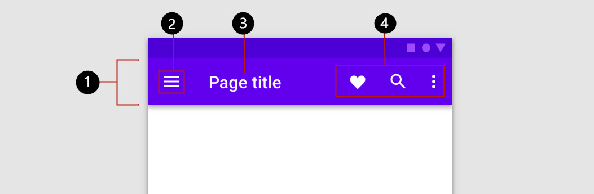
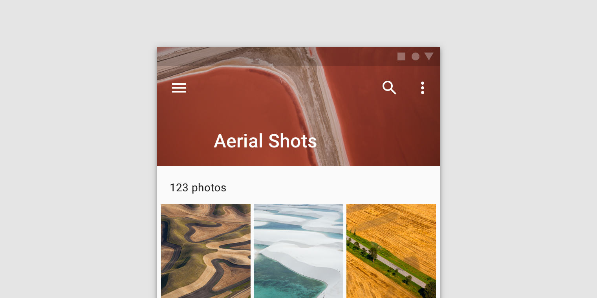

import CardStoryLayout from '../components/CardStoryLayout';
import AppBar from '@sinoui/core/AppBar';
import AppBarTitle from '@sinoui/core/AppBarTitle';
import NavigationIcon from '@sinoui/core/NavigationIcon';
import AppBarActions from '@sinoui/core/AppBarActions';
import {
  BaseAppBarDemo,
  AppBarInput,
  AppBarInputRight,
} from '../../../stories/appBarDemos';

## 顶部应用栏组件结构

按照从左到右的顺序，建议在顶部应用程序栏中如下方式放置元素：

- 在应用栏的最左侧放置导航图标
- 在应用栏的导航图标右侧放置标题
- 在应用栏的最右侧放置可操作的元素，比如图片、搜索区域



## 应用栏模式

根据应用栏的不同形态将应用栏分为以下几种模式：

- 标准模式(默认形式)
- 突出模式(prominent)
- 密集模式(dense)
- 可收缩模式(short)
- 一直收缩模式(shortCollapsed)
- 固定模式(fixed)

### 标准模式

Demo.tsx:

```tsx
import React, { useRef } from 'react';
import { ThemeProvider } from 'styled-components';
import { defaultTheme } from '@sinoui/theme';
import AppBar from '@sinoui/core/AppBar';
import IconButton from '@sinoui/core/IconButton';
import Dehaze from '@sinoui/icons/Dehaze';
import Favorite from '@sinoui/icons/Favorite';
import Bookmark from '@sinoui/icons/Bookmark';

export default function Demo(props: {
  prominent?: boolean;
  dense?: boolean;
  fixed?: boolean;
  short?: boolean;
  shortCollapsed?: boolean;
}) {
  const targetScrollRef = useRef<HTMLDivElement>(null);
  return (
    <ThemeProvider theme={defaultTheme}>
      <div ref={targetScrollRef} style={{ height: '200px', overflowY: 'auto' }}>
        <AppBar
          {...props}
          targetScroll={targetScrollRef}
          title="标题标题标题标题标题标题标题标题标题标题标题标题标题标题标题标题标题标题标题标题标题标题标题标题标题标题标题标题标题标题标题"
          navigationIcon={
            <IconButton color="#fff">
              <Dehaze />
            </IconButton>
          }
          actionItems={[
            <IconButton color="#fff">
              <Favorite />
            </IconButton>,
            <IconButton color="#fff">
              <Bookmark />
            </IconButton>,
          ]}
        />
        <div>
          {[1, 2, 3, 4, 5, 6, 7, 8, 9, 10, 11, 12, 13, 14].map(
            (index: number) => (
              <h1 style={{ margin: '0 0 10px 0' }}>item{index}</h1>
            ),
          )}
        </div>
      </div>
    </ThemeProvider>
  );
}
```

示例：

```tsx
<BaseAppBarDemo />
```

运行效果：

<CardStoryLayout style={{ flexDirection: 'column', width: '500px' }}>
  <BaseAppBarDemo />
</CardStoryLayout>

标准模式下的顶部应用显示栏标题文字时注意事项：

- 不建议标题文字换行
- 不建议标题文字过多时省略号显示
- 不建议标题文字过多时缩放显示
- 标题文字过多时建议使用突出模式顶部应用栏

### 突出模式(prominent)

突出的顶部应用栏可用于较长的标题展示，可以容纳图像，或作为一个更强大的顶部应用栏。

示例：

```tsx
<BaseAppBarDemo prominent />
```

运行效果：

<CardStoryLayout style={{ flexDirection: 'column', width: '500px' }}>
  <BaseAppBarDemo prominent />
</CardStoryLayout>

**注意事项：突出模式的顶部应用栏在容纳图像时不用使用容易使应用栏图标和文字变得难以辨认的图片。**


不推荐:


### 密集模式(dense)

需要以更小的高度展示应用栏时，可以使用密集。

示例：

```tsx
<BaseAppBarDemo dense />
```

运行效果：

<CardStoryLayout style={{ flexDirection: 'column', width: '500px' }}>
  <BaseAppBarDemo dense />
</CardStoryLayout>

### 可收缩模式(short)

当屏幕中页面内容发生滚动时，可收缩模式下的应用栏会变为收缩状态，内容滚动顶部时恢复态应用栏初始状。

示例：

```tsx
<BaseAppBarDemo short />
```

运行效果：

<CardStoryLayout style={{ flexDirection: 'column', width: '500px' }}>
  <BaseAppBarDemo short style={{ position: 'relative' }} />
</CardStoryLayout>

### 收缩模式(shortCollapsed)

当需要以更小的空间展示顶部应用栏时，可以使用收缩模式的应用栏。收缩模式下的应用栏只展示左侧的导航图标和可操作区域最后一个元素。

示例：

```tsx
<BaseAppBarDemo shortCollapsed />
```

运行效果：

<CardStoryLayout style={{ flexDirection: 'column', width: '500px' }}>
  <BaseAppBarDemo shortCollapsed style={{ position: 'relative' }} />
</CardStoryLayout>

### 固定模式(fixed)

固定模式下的应用栏，页面内容发生滚动时应用栏位置固定显示在页面顶部，不随着内容的滚动而滚动。

示例：

```tsx
<BaseAppBarDemo fixed />
```

运行效果：

<CardStoryLayout style={{ flexDirection: 'column', width: '500px' }}>
  <BaseAppBarDemo fixed style={{ position: 'relative' }} />
</CardStoryLayout>

## 含有输入框的应用栏示例

### 输入框紧挨在标题的右侧

代码：

```tsx
<AppBar
  title={
    <>
      <div>标题</div>
      <input placeholder="请输入" style={{ height: '32px' }} />
    </>
  }
  navigationIcon={
    <Icon>
      <MdDehaze />
    </Icon>
  }
  actionItems={[
    <Icon>
      <MdFavorite />
    </Icon>,
    <Icon>
      <MdBookmark />
    </Icon>,
  ]}
/>
```

运行效果：

<CardStoryLayout>
  <AppBarInput />
</CardStoryLayout>

### 输入框在可操作区域的左侧

```tsx
<AppBar
  title="标题"
  navigationIcon={
    <Icon>
      <MdDehaze />
    </Icon>
  }
  actionItems={[
    <input placeholder="请输入" style={{ height: '32px' }} />,
    <Icon>
      <MdFavorite />
    </Icon>,
    <Icon>
      <MdBookmark />
    </Icon>,
  ]}
/>
```

运行效果：

<CardStoryLayout>
  <AppBarInputRight />
</CardStoryLayout>
